# Database & System Diagrams

This document contains comprehensive diagrams for understanding the system architecture, data models, workflows, and integrations.

---

## Table of Contents

1. [Entity-Relationship Diagram (ERD)](#entity-relationship-diagram-erd)
2. [State Diagrams](#state-diagrams)
3. [Sequence Diagrams](#sequence-diagrams)
4. [Data Flow Diagrams](#data-flow-diagrams)

---

## Entity-Relationship Diagram (ERD)

### Complete Database Schema

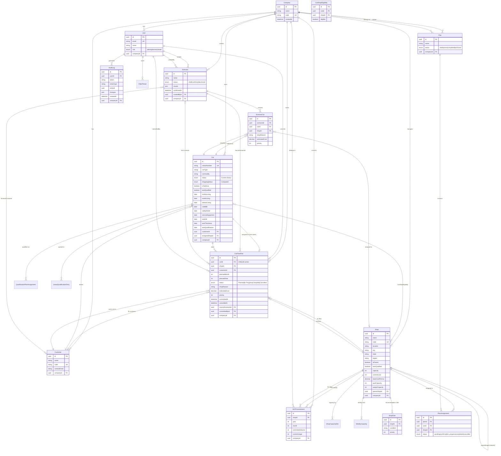

### Simplified Core Relationships

```mermaid
erDiagram
    Customer ||--o{ Car : "leases"
    Car ||--o| CarFlowPlan : "one active plan"
    CarFlowPlan }o--|| Shop : "assigned to"
    Shop ||--o{ SOPCommitment : "monthly capacity"
    Scenario ||--o{ ScenarioCar : "draft assignments"
    Scenario ||--o{ CarFlowPlan : "generates on confirm"

    Car {
        string railcarNumber PK
        boolean isTankCar
        enum shoppingStatus
        date[] qualificationDates
    }

    CarFlowPlan {
        uuid carId FK_UK
        uuid shopId FK
        int plannedMonth
        int plannedYear
        enum status
    }

    Shop {
        string code PK
        boolean tankQualified
        int capacity
    }

    SOPCommitment {
        uuid shopId FK
        int year
        int month
        int committedVolume
        int currentUsage
    }
```

### Key Relationship Rules

| Relationship | Cardinality | Business Rule |
|--------------|-------------|---------------|
| Car → CarFlowPlan | 1:0..1 | Each car can have **only ONE active** CarFlowPlan (status != 'Cancelled') |
| Shop → CarFlowPlan | 1:N | A shop can receive many cars |
| Scenario → CarFlowPlan | 1:N | Confirming a scenario creates CarFlowPlans |
| Shop → SOPCommitment | 1:N | One commitment per shop/month (unique constraint) |
| Car → Shop (Tank) | Conditional | Tank cars can ONLY go to tankQualified shops |

---

## State Diagrams

### Car Status State Machine

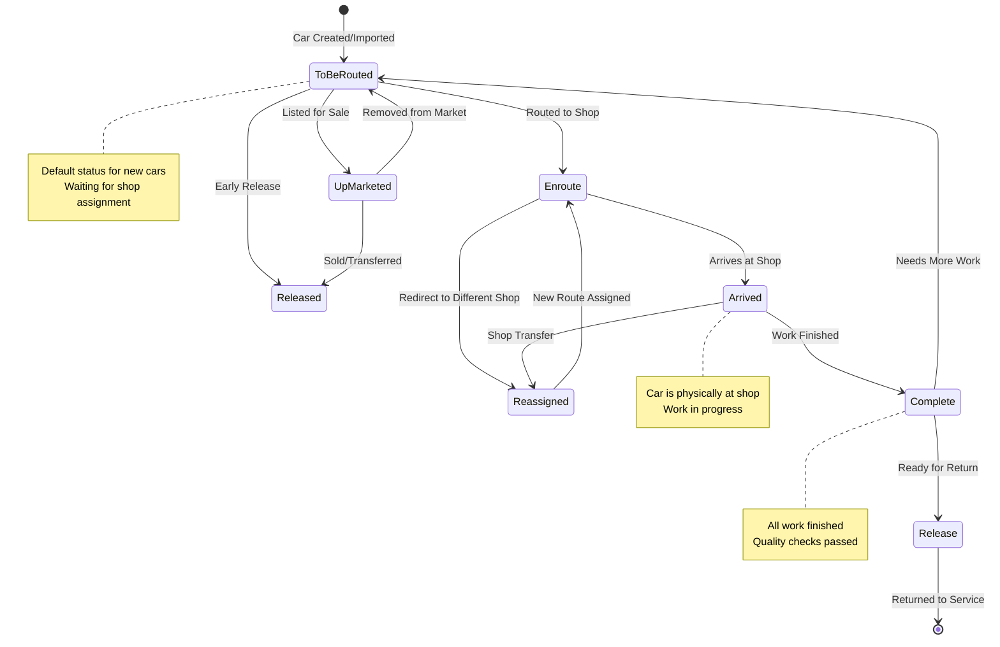

### Shopping Status State Machine (Computed from Qualification Dates)

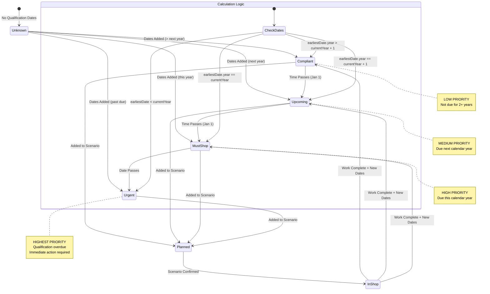

### Scenario Status State Machine

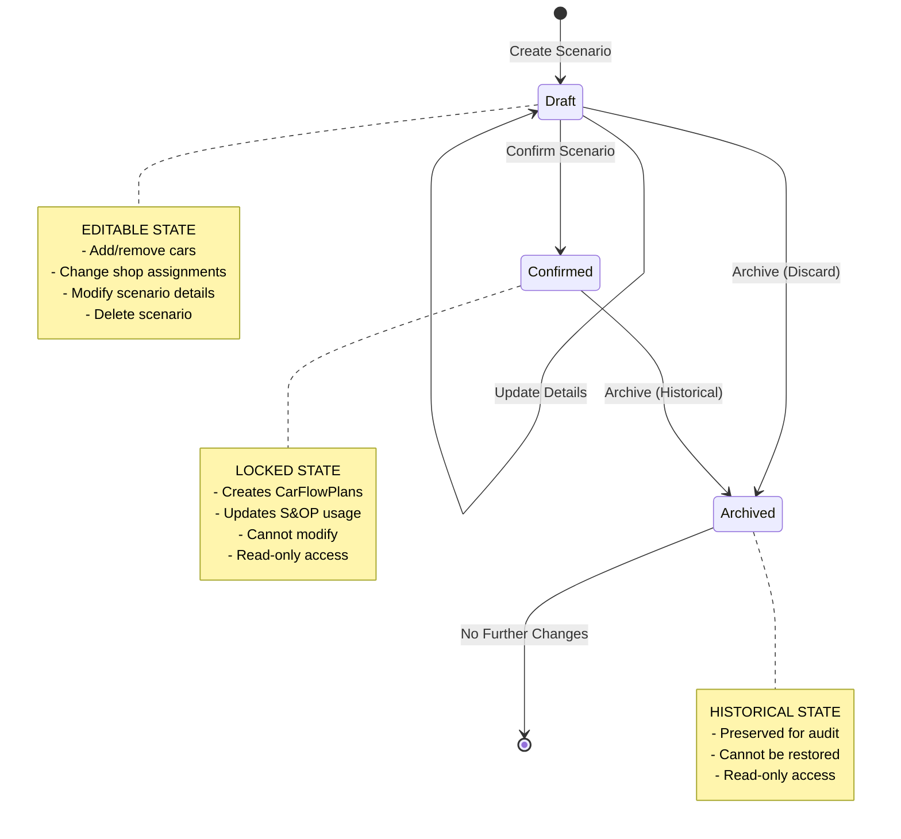

### CarFlowPlan Status State Machine

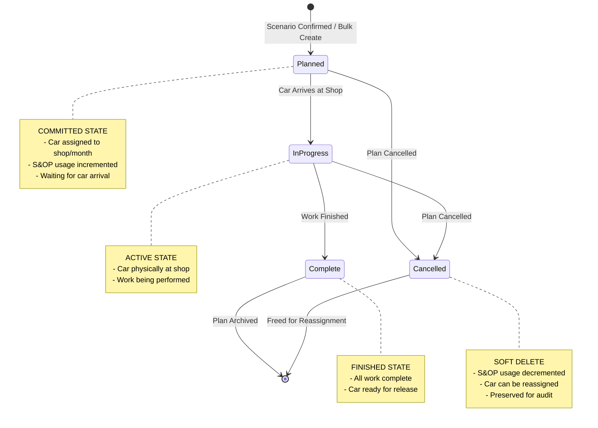

### Plan Status State Machine (Legacy)

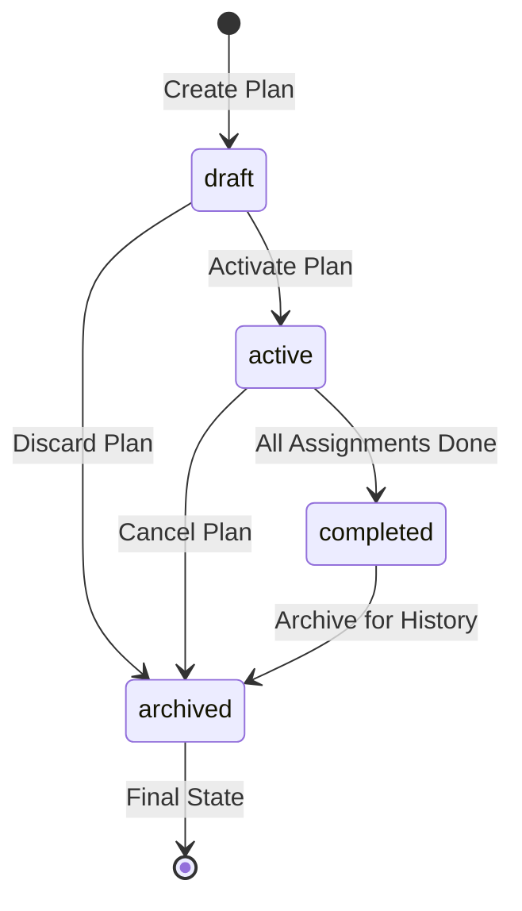

---

## Sequence Diagrams

### Scenario Confirm Flow (Primary Save Operation)

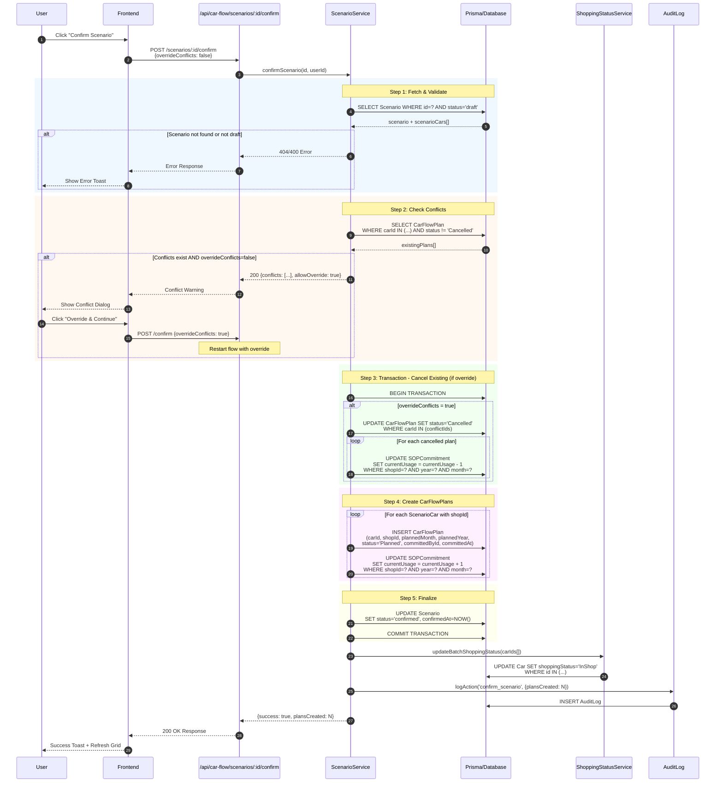

### Bulk Plan Creation Flow

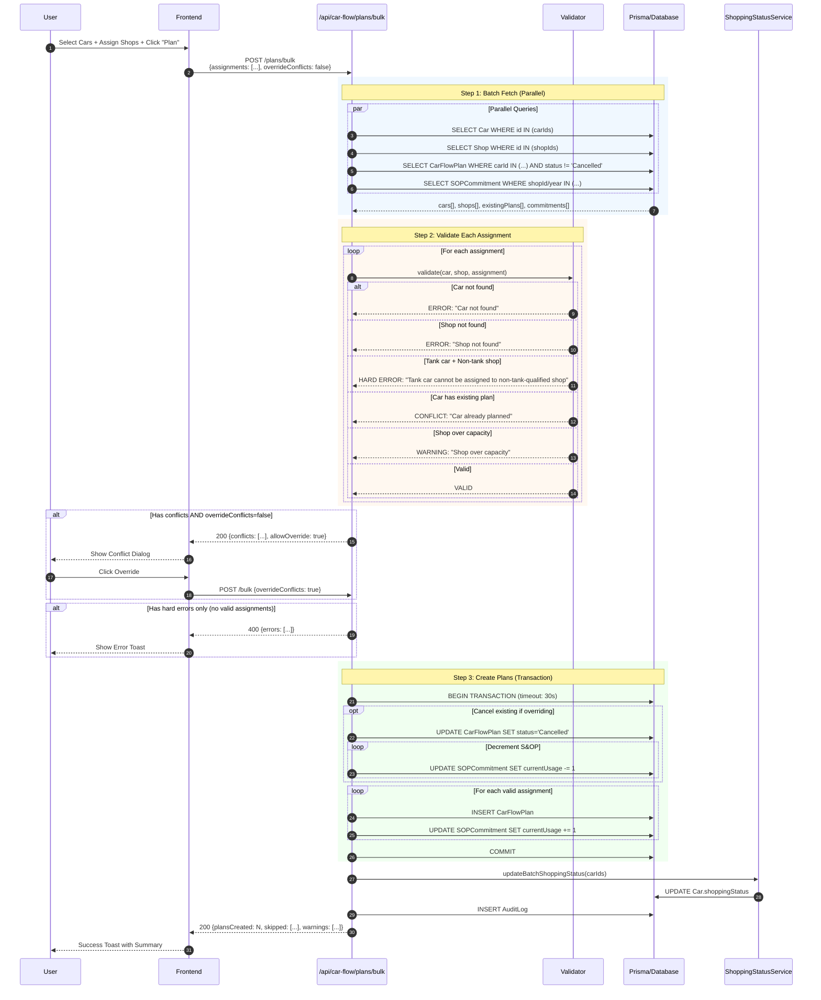

### Cancel CarFlowPlan Flow

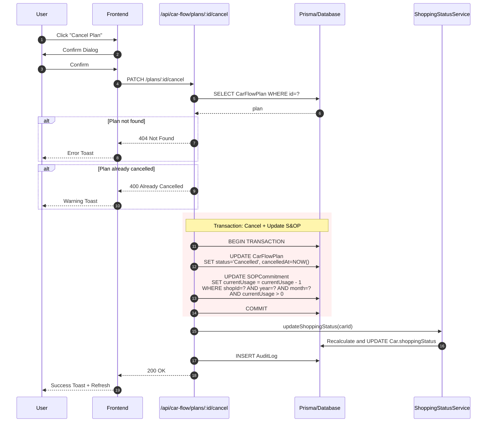

### Debugging Save Failures - Common Error Points

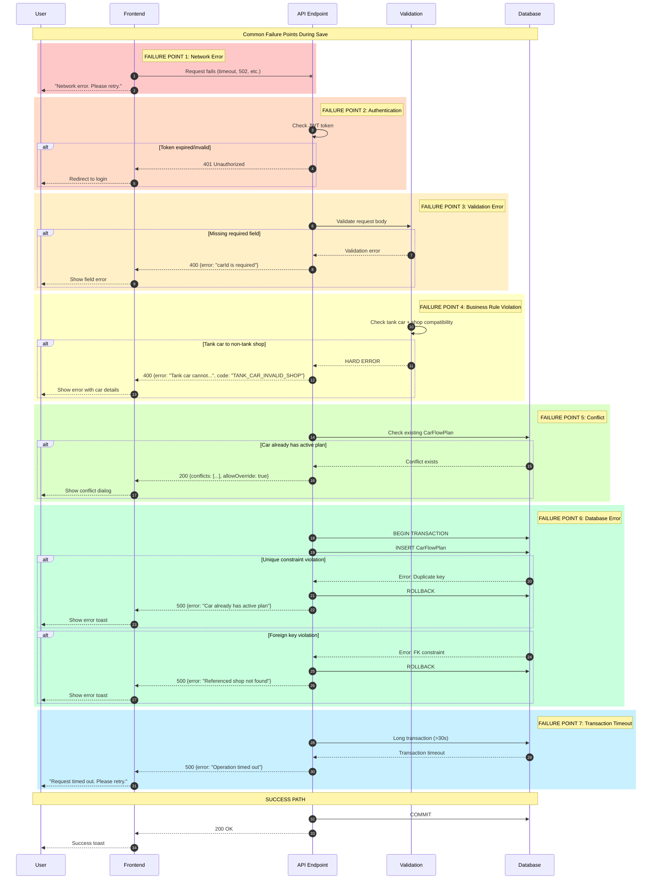

---

## Data Flow Diagrams

### System Overview - Data Sources and Destinations

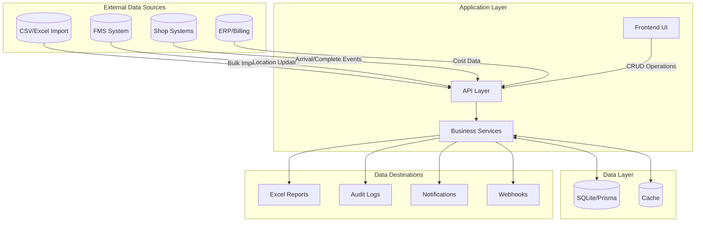

### Car Data Flow

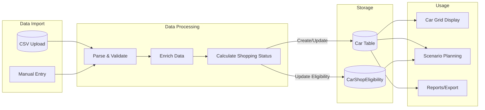

### Planning Data Flow (Scenario to CarFlowPlan)

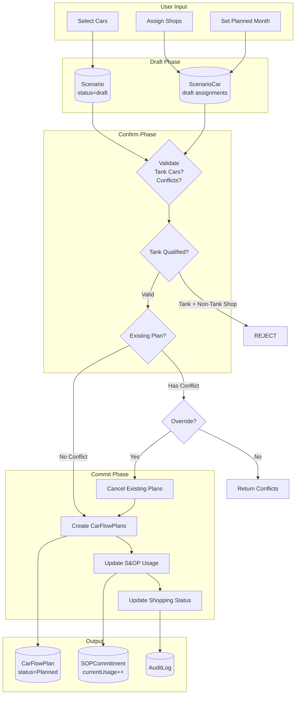

### S&OP Capacity Data Flow

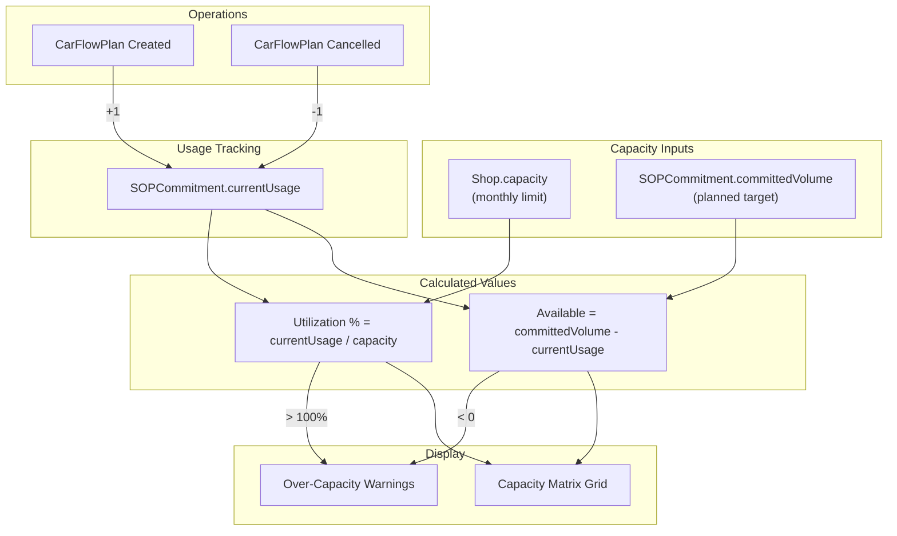

### Complete Integration Data Flow

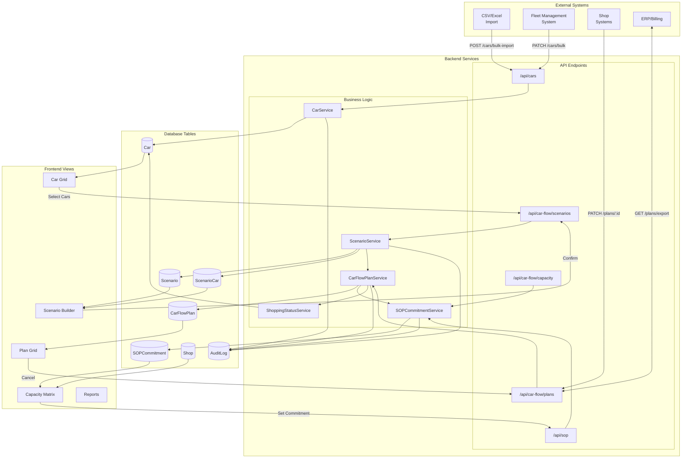

---

## Quick Reference

### Status Transition Summary

| Entity | From Status | To Status | Trigger |
|--------|-------------|-----------|---------|
| **Car.status** | To Be Routed | Enroute | Routed to shop |
| | Enroute | Arrived | Arrives at shop |
| | Arrived | Complete | Work finished |
| | Complete | Release | Ready for return |
| **Car.shoppingStatus** | Any | Planned | Added to scenario |
| | Planned | In Shop | Scenario confirmed |
| | In Shop | Compliant/etc | Work complete |
| **Scenario.status** | draft | confirmed | User confirms |
| | draft/confirmed | archived | User archives |
| **CarFlowPlan.status** | (created) | Planned | Created |
| | Planned | In Progress | Car arrives |
| | In Progress | Complete | Work done |
| | Any | Cancelled | User cancels |

### S&OP Usage Rules

| Action | SOPCommitment.currentUsage |
|--------|---------------------------|
| CarFlowPlan created | +1 |
| CarFlowPlan cancelled | -1 |
| Scenario confirmed | +1 per car with shop |
| Existing plan overridden | -1 (old) +1 (new) = net 0 |

### Critical Validation Rules

1. **Tank Car Rule**: `car.isTankCar && !shop.tankQualified` = HARD BLOCK
2. **One Plan Rule**: Each car can have only ONE active CarFlowPlan
3. **Capacity Warning**: `currentUsage > committedVolume` = WARNING (not blocking)
4. **Scenario Lock**: Confirmed scenarios cannot be modified

---

*Generated for the Car Flow Planning System - Last Updated: 2025*
